# RH-SSO integration with AWS
## Introduction
The following diagram illustrates the SAML-enabled single sign-on flow for [SAML-enabled flow](#useful-links)[1]:
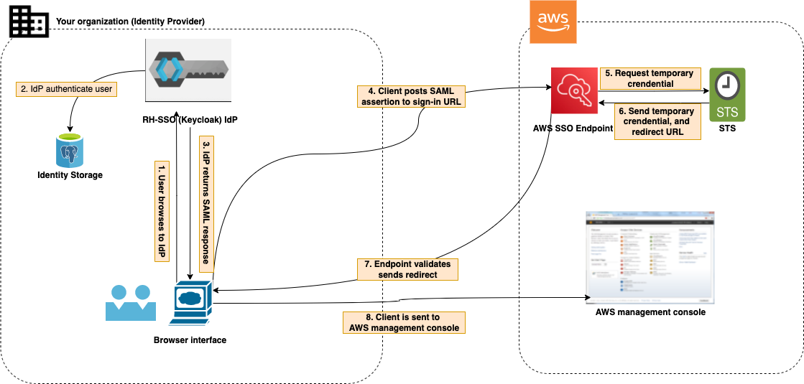. RH-SSO works as the identity provider while AWS works as the service provider.

In AWS, only IdP-initiated SAML flow is supported, which means user needs to be provided with the URL from the IdP to access the Single Signon page for AWS.

The scripts for AWS is fully automated, which creates and configures the client on Keycloak, and set up identity provider and on AWS IAM.

## Prerequisites
- Working RH-SSO instance
- Working AWS management console. Note: this aws account must have a "clean" IAM setup. It has never been setup by this instruction. Otherwise, please clean the existing configuraitons by:
  - Delete IAM SAML target identity provider (e.g. demo) from this instruction
  - Detach the policy fromt he role based on this instruction
  - Delete the role 
- Administrator access for AWS account and RH-SSO
- [Environment Variables](../README.md#integration-with-rhsso-environment-variables) provided to `argocd-configs` Config Map and `sso-configs` Secret. Remember to include all variables provided on `Location` column for `AWS` and `Common`.
- [Automation Only](#automation) Openshift / K8S cluster / Docker

## Automation
* **Step 1: Create an image for deploying client**
    * Create an image using file [config-aws.sh](../config-aws.py).  A complete list of environment variables can be found at [Integration with RH-SSO Environment Variables](https://github.com/otp-demo/rhsso-auto#integration-with-rhsso-environment-variables).
* **Step 2: Run script to create an image and run from a Dockerfile**
 * After you are satisfied with variables, payload information etc. in [create-client-aws.py](../create-client-aws.py) and [update-keycloak-aws-configs.py](../update-keycloak-aws-configs.py) files, you can use a script [config-aws.sh](../config-aws.sh) to run .py and create a Dockerfile that that installs [requirements](../requirements.txt) and runs [config-aws.sh](../config-aws.sh). For testing, you can also run it locally by setting local environment variables or storing them in .env file.
    * **Run locally**
      ```bash
      python3 create-client-aws.py 
      python3 update-keycloak-aws-configs.py.py 
      ```
    * **Build as an image**
      Navigate to the root directory of this project and build the image using docker or podman and run the following command. Update repository name and image name as required in build and push commands.
      
      ```bash
        docker build -t quay.io/leoliu2011/aws-keycloak-integration:v1 -f Dockerfile-aws .
        docker push quay.io/leoliu2011/aws-keycloak-integration:v1
      ```

* **Step 3: Running in Kubernetes or OpenShift**
  This script is designed to be ran as a Job in a Kubernetes-like environment. This Job will run a container containing this script once using the environment variables provided to it. You will likely need to push an image of this script with your payload attributes to a container registry that your cluster can reach. It is recommended that you get the admin username and password from a Secret or similarly secure resource.

    **Example Job**
    ```yaml
    apiVersion: batch/v1
    kind: Job
    metadata:
    name: aws-keycloak-integration
    namespace: sso-integration
    spec:
    template:
        spec:
        containers:
        - name: aws-keycloak-integration
            image: quay.io/leoliu2011/aws-keycloak-integration:v1
            imagePullPolicy: Always
            envFrom:
            - configMapRef:
                name: argocd-configs
            - secretRef:
                name: sso-configs
        restartPolicy: Never
    backoffLimit: 5
    ```
Note: the image can be also run locally with container runtime. Remember to include all environment variables by combining all variables from `argocd-config` and `sso-configs` 

## Manual Configuration
This figure below illustrates high-level steps of confiugraitons on RH-SSO (Keycloak), which you can also find the corresponding automation script in [config-aws.sh](../config-aws.sh).
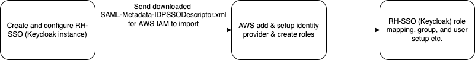

### Keycloak - Configure AWS as a client.
- Create and configure AWS as a client in the target realm on RH-SSO
1. Create a target realm if not existing. 
2. Hit "Clients" tab on the left navigation menu, and hit create.
3. We need to register AWS as the service provider (SP)/ client using the SAML metadata document provided by AWS, and set in on RH-SSO
  - Download the [saml file](https://signin.aws.amazon.com/static/saml-metadata.xml)
  - Import the SAML xml file by clicking import button on "Add Client" page
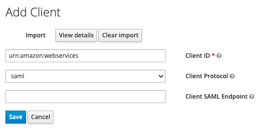
  - After client has been saved, change `Base URl` and `IDP initiated SSO URL Name`
    - Base URl = (replace your_realm_name with the realm name, for us it is `rhsso-service-demo-v7`)`/auth/realms/rhsso-service-demo-v7/protocol/saml/clients/amazon-aws`
    - IDP initiated SSO URL Name = `amazon-aws`
4. Go to "Scope" tab on the client, and turn off "Full Scope Allowed"
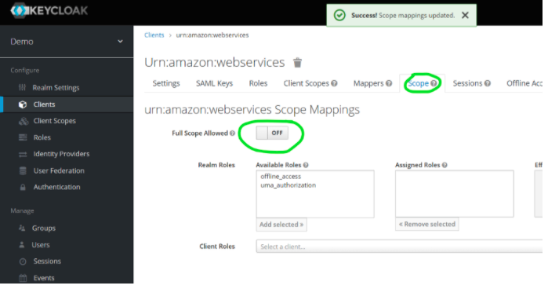

5. Download the IDP SSO descriptor by running `SAML-Metadata-IDPSSODescriptor.xml` and save locally
`curl -k -o SAML-Metadata-IDPSSODescriptor.xml "${KEYCLOAK_HOSTNAME}/auth/realms/${KEYCLOAK_REALM}/protocol/saml/descriptor"`
Replace the `KEYCLOAK_HOSTNAME` and `KEYCLOAK_REALM` with proper values

- AWS Add & Setup Identity Provider & Roles
1. Go to AWS IAM service, hit identity provider button, Create provider
2. Select Provider Type as **SAML** -> enter provider name as **demo** -> choose the file **SAML-Metadata-IDPSSODescriptor.xml** from earlier steps and click on Next Step.
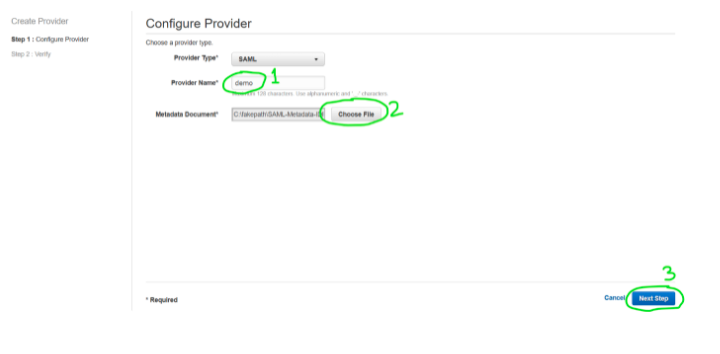
3. Next -> Create
4. Upon successful creation, you will see a list of providers as below
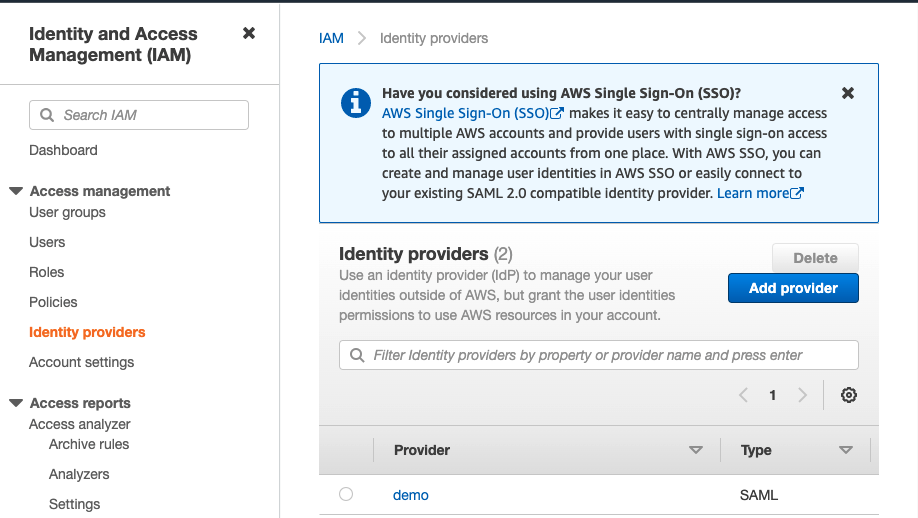
5. Copy the arn of the provider
6. Click Roles on IAM, and hit **Create Role**
  - Click on SAML 2.0 federation
  - Select your(created in previous steps) SAML provider.
  - Select Allow programmatic and AWS Management Console access
  - Click on the Next button
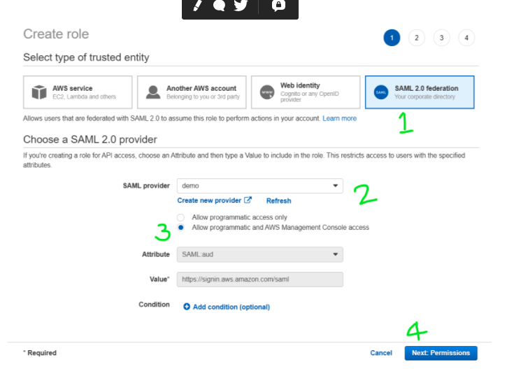
7. Attach permissions, policies etc.
  - For demo, **ReadOnlyAccess** policy is selected
  - After the role is created, click on the role and copy the role's **ARN** (saved for later use)
    - example — arn:aws:iam::<AWS_ACCOUNT_NUMBER>:role/READ_ONLY_USER_ROLE
  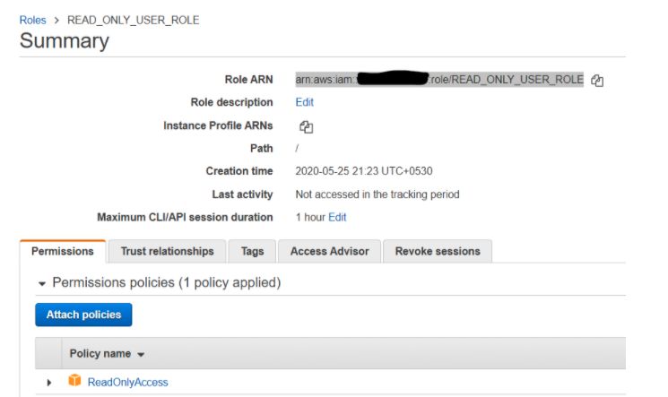

- Keycloak Role Mpaaing, Group, and User Setup.
1. Create a comma separated value of the role’s ARN and identity provider’s(saml) ARN that you created above in aws
  - role name = arn:aws:iam::<AWS_ACCOUNT_NUMBER>:role/READ_ONLY_USER_ROLE,arn:aws:iam::<AWS_ACCOUNT_NUMBER>:saml-provider/demo
  - AWS_ACCOUNT_NUMBER = your aws account’s number
  - READ_ONLY_USER_ROLE = role that you created above in aws
  - demo = name of the identity provider you created above in aws
  NOTE — the above role name is required in below steps
2. Create a new role in the already created client which is urn:amazon:webservices from the previous steps
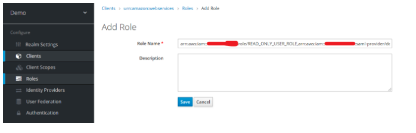
3. After saving the role, go to **Mappers** tab on that client, and hit **Create**
  - Mapper 1 Create a Session Role Mapper like below
    ```bash
    Mapper Type = Role List
    Name & Friendly Name = Session Role
    Role attribute name = https://aws.amazon.com/SAML/Attributes/Role
    ```
  - Mapper 2 User Property Session Name Mapper
    ```
    Mapper Type =  User Property
    Name & Friendly Name = Session Name
    SAML Attribute Name = https://aws.amazon.com/SAML/Attributes/RoleSessionName
    ```

  - Mapper 3 Session Duration Mapper
  ```
    Mapper Type = Hardcoded attribute
    Name & Friendly Name = Session Duration
    SAML Attribute Name = https://aws.amazon.com/SAML/Attributes/SessionDuration
  ```
4. Create groups
  - Now click on the Groups in the Manage section. Create a group name example `READ_ONLY_AWS_USERS`.
  - Go to Role Mapping tab on the client, search for `urn:amazon:webservices`, select all roles, and hit assign
  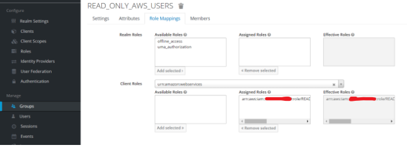
5. Create users and assign the user to the group `READ_ONLY_AWS_USERS`

- Post cleaning
Since the client `urn:amazon:webservices ` has a default `role_list` on the **Client Scopes** tab, which conflicts with above-created client mapper `Session Role`. This needs to be removed from the **Assigned Default Client Scopes**
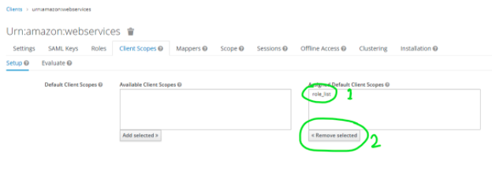

- Demo
Now hit `Base URL` on the client item `urn:amazon:webservices`. You will be redirected to the realm login page, and then redirected to the AWS management console.

Note: You can of course create more roles with different policies in AWS IAM, and associate in RH-SSO instance. By doing that, you will be able to choose different roles upon successful login.
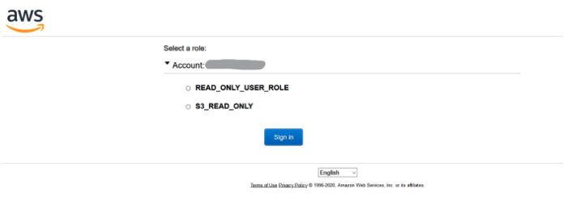


## Caveats
⚠️ This is IdP intiated-flow SAML. So user needs to be provided with the url link from `Base URL` from the aws client on RH-SSO. 

## Useful links
1. [Enabling SAML 2.0 federated users to access the AWS Management Console](https://docs.aws.amazon.com/IAM/latest/UserGuide/id_roles_providers_enable-console-saml.html)
2. [AWS SAML based User Federation using Keycloak](https://neuw.medium.com/aws-connect-saml-based-identity-provider-using-keycloak-9b3e6d0111e6)
3. [Troubleshooting SAML on AWS](https://docs.aws.amazon.com/IAM/latest/UserGuide/troubleshoot_saml.html)