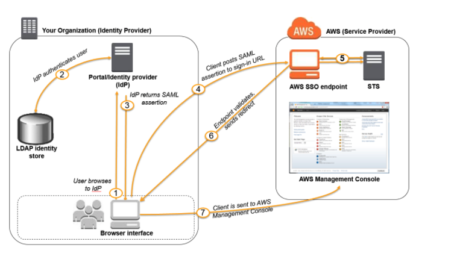

# RH-SSO integration with AWS
## Introduction
The following diagram illustrates the flow for [SAML-enabled flow](#useful-links)[1]:

## Prerequisites

## Automation

## Manual Configuration

## Useful links
1. [Enabling SAML 2.0 federated users to access the AWS Management Console](https://docs.aws.amazon.com/IAM/latest/UserGuide/id_roles_providers_enable-console-saml.html)
2. [AWS SAML based User Federation using Keycloak](https://neuw.medium.com/aws-connect-saml-based-identity-provider-using-keycloak-9b3e6d0111e6)
3. 