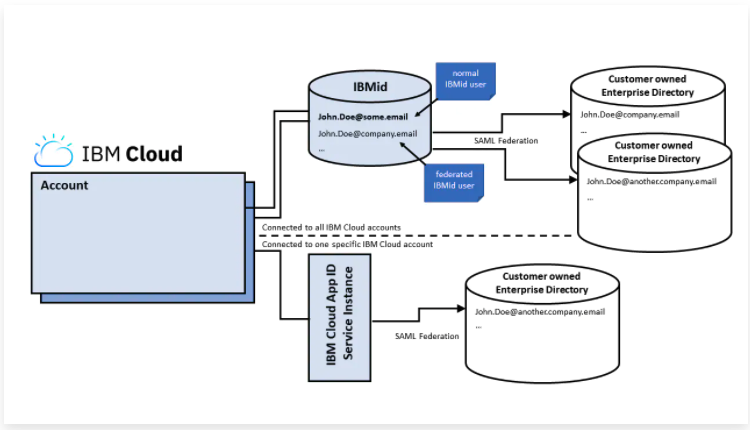
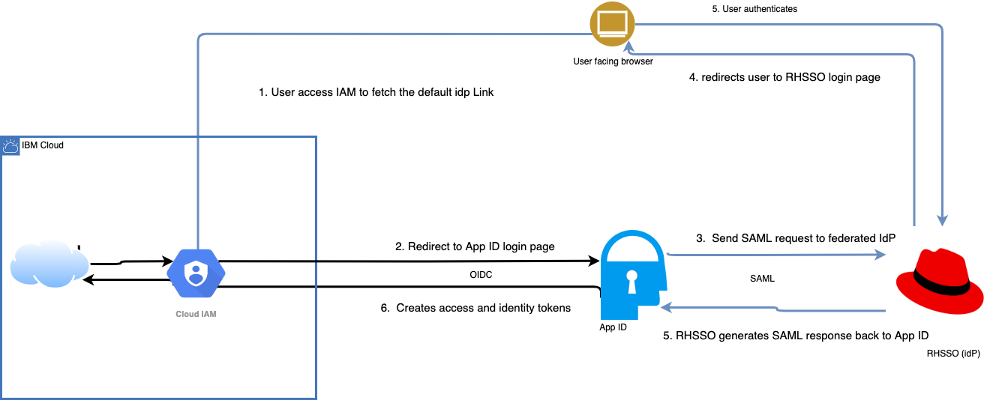

There is a need to integrate RHSSO with IBM cloud because for the managed openshift cluster on IMB Cloud, IBM automatically sets up the OAuth server to use IBM Cloud IAM. You can't change the identity provider. IBM Cloud IAM is also set up to automatically sync to RBAC so that you can use IAM to manage access to and within the cluster. Therefore, the [OAuth setup for vanilla openshift cluster](https://docs.openshift.com/container-platform/4.8/authentication/identity_providers/configuring-oidc-identity-provider.html) will not work, as all authenticated related operator and pods are disabled, and OAuth CR won't be managed. Using ID federation with IAM will be a feasible approach.


In order to integrate to IBM cloud, 2 optioons are available: IBM Cloud App ID and IBM id. High level flow:


IBM Cloud App ID is suitable for our use case based on the [cloud saml federation guide](https://www.ibm.com/cloud/blog/ibm-cloud-saml-federation-guide):
1) App ID is self-service, and doesn't require manual process. This allows further automation.
2) The federation only has impact on the the IBM Cloud account in which the IBM Cloud App ID instance is configured to allow logins. It does not impact any other IBM Cloud accounts or IBM SaaS offerings.


# Pre-requisites
1. Create an instance of App ID from IBM cloud catalog.
2. Make sure you have the required access to view and manage IdP references, if you aren't the account owner. You must be assigned the operator role or higher on the App ID instance and the operator or administration role on the IAM Identity Service.

# Configuration of your App ID instance for IAM integration
If you plan to use your App ID instance for IAM IdP integration, then any user can log in to your account who can authenticate with that App ID instance. Therefore, consider following these guidelines when you configure your instance:

Disable the following types of authentication:

- Facebook
- Google
- IBMid
- Anonymous

# Setting IAM-specific attributes in App ID tokens
1. Create api key for IAM: `ibmcloud iam api-key-create api-key --file api-key.json`
2. Assign the api key from `api-key.json` to API_KEY
3. Fetch the access token by
```bash
IAM_TOKEN=$(curl -k -X POST "https://iam.cloud.ibm.com/identity/token" \
--header "Content-Type: application/x-www-form-urlencoded" \
--header "Accept: application/json" \
--data-urlencode "grant_type=urn:ibm:params:oauth:grant-type:apikey" \
--data-urlencode "apikey=${API_KEY}" |\
jq -r '.access_token')
```
4. Get the tenant ID for your instance of the service. You can find the value in either your service or application credentials.
5. Make a PUT request to the /config/tokens endpoint with your token configuration.
```bash
curl -X PUT "https://$REGION.appid.cloud.ibm.com/management/v4/$TENANT_ID/config/tokens" -H 'Content-Type: application/json' -H "Authorization: Bearer $IAM_TOKEN" -d '{
   "access": {
         "expires_in": 3600
   },
   "refresh": {
         "enabled": true,
         "expires_in": 2592001
   },
   "anonymousAccess": {
         "enabled": false
   },
   "accessTokenClaims": [
         {
            "source": "roles"
         },
         {
            "source": "saml",
            "sourceClaim": "identifier",
            "destinationClaim": "ID"
         },
         {
            "source": "saml",
            "sourceClaim": "email",
            "destinationClaim": "email"
         },
         {
            "source": "saml",
            "sourceClaim": "username",
            "destinationClaim": "preferred_username"
         },
         {
            "source": "saml",
            "sourceClaim": "firstname",
            "destinationClaim": "given_name"
         },
         {
            "source": "saml",
            "sourceClaim": "lastname",
            "destinationClaim": "family_name"
         }
   ],
   "idTokenClaims": [
         {
         "source": "saml",
         "sourceClaim": "attributes.uid"
         }
   ]
}'
```
Refer to [Customizing tokens](https://cloud.ibm.com/docs/appid?topic=appid-customizing-tokens) for more information regarding the setup payload. [App ID token claims](https://cloud.ibm.com/docs/account?topic=account-idp-integration#iam-idp-attributes) for what user information is required for the flow to work.


# Connect RHSSO(IdP) with App ID through SAML
1. On the App ID page, Click the *Manage authentication -> Identity Providers -> SAML 2.0 Federation*

2. Hit bit blue "Download SAML metadata file", and save that xml file locally

3. Import step 2 SAML metadata to keycloak instance to create a new client, client name should be like `urn:ibm:cloud:services:appid:63859dbb-982a-42aa-885a-68e88de4236b`

4. Go to path `${keycloak_host}/auth/realms/rhsso-service-demo-v7/protocol/saml/descriptor`, note down infomration for `entityID`, `X509Certificate`, ``


5. Go back to App ID, and fill out above information in respective places, plus Sign in URL being: `${keycloak_host}/auth/realms/rhsso-service-demo-v7/protocol/saml`

6. Hit "Test", and it should take you to the log in page with smile face if configuration succeeds

# Connect App ID to IAM
1. Enable the login settings for your account. You can skip this step if you've already enabled this setting.
 - Go to Manage > Access (IAM) > Identity providers, and click Enable.
 - Enter an alias for the default account URL, which you provide to users to log in to your account.
2. Click Create to create your IdP reference.
3. Enter a name for the IdP reference, and select the App ID instance that you want to connect. Then, select the following options:
    - Enable for account login?: Enable your IdP references to be used for users to log in to your account. This option is set by default when you first create an IdP reference.
    - Set as the default?: When selected, users can use the default IdP reference URL that you created when you enabled this feature to log in to your account. You can have only one default IdP reference. For all other IdP references that you create, users must use the realm IDs to log in.

4. Hit create

# Log in using the RHSSO user info to create a user in IAM
1. Go to IAM, and Identity providers
2. Hit tree vertical dots, and click IdP Url, and copy the `IdP URL`
3. Browse the url, and you will see follwing login page

4. Hit "Login with SAML", and redirect you to the RHSSO login page, and login.


# Assign correct access groups or dynamic rules to access the Openshift cluster
1. Go to IAM, and "Users". Select the user RHSSO federates. 
2. In the "Access Groups" tab, choose the group that can have admin permissions on Openshift clusters. If no group works, create one you want. You can also create "Dynamic rules". [More information](https://cloud.ibm.com/docs/account?topic=account-rules)


# Caveats
1. This is IdP-initiated flow. So will need user to copy the IdP default link from IBM cloud IAM page. 

# Useful links
- [Enabling authentication from an external identity provider
](https://cloud.ibm.com/docs/account?topic=account-idp-integration)

- [IBM Cloud SAML Federation Guide
](https://www.ibm.com/cloud/blog/ibm-cloud-saml-federation-guide)

- [IBMid Federation Guide](https://ibm.ent.box.com/notes/78040808400?v=IBMid-Federation-Guide)

- [High level steps](https://www.ibm.com/cloud/blog/announcements/ibm-cloud-self-service-federation-for-external-identity-providers)


- [Customize App ID tokens](https://cloud.ibm.com/docs/appid?topic=appid-customizing-tokens)

- [APP ID SAML flow](https://cloud.ibm.com/docs/appid?topic=appid-enterprise)