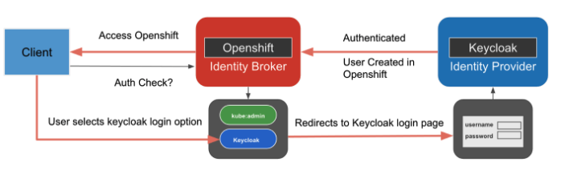
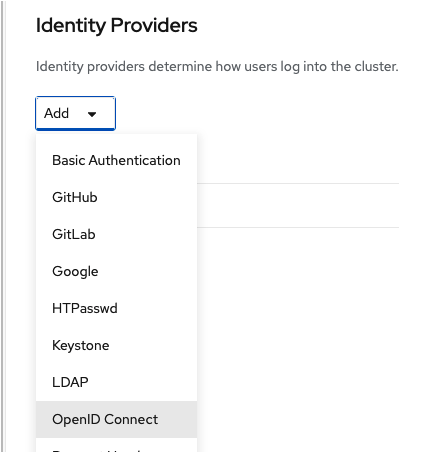
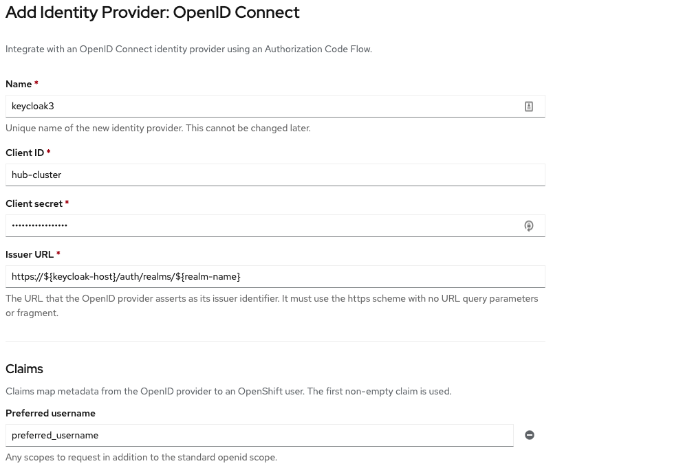
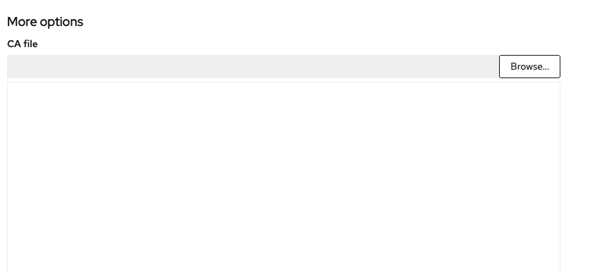

# Introduction
we will see using Keycloak as an Identity Provider for your Openshift cluster act as an Identity Broker. Vise versa is also possible, which won't be covered in this tutorial


Figure 1.1

Once you configure the identity provider is configured, you will see a new button displayed below the original `kubeadmin` login button. 

This tutorial applies to all vanilla Openshift clusters, including the hub cluster and managed clusters.

# Prerequisites
- Vanilla Openshift cluster. (Notice that any managed Openshift cluster with Cloud IAM set up, this approach will not work. Please refer to instruction for [IBM cloud with RHSSO](IBM-cloud.md))
- RHSSO operator and instance ready.
- CA certificate bundle for RHSSO instance if it has a self-signed cert configuration

# Configuration
1. Create an OIDC client with the following cofigurations on RHSSO
```bash
Client ID: hub-cluster
Client Protocol: openid-connect
Access Type: confidential
Standard Flow Enabled: On
Valid Redirect URI: https://${cluster_domain}/oauth2callback/${idp_provider_name} (Recommended for production)
```
Where
- `cluster_domain`: the root url for the cluster
- `idp_provider_name`: Name define in Openshift for the configuration (See figure 1.3)

2. Go to Openshift Console as the `Kubeadmin`, 
- "Administration -> Cluster Settings -> Global Configuration -> Oauth"
- Click Add button under "Identity Providers",  and choose OpenID Connect


Figure 1.2

3. Configure OAuth Openshift

Figure 1.3
```bash
Name: keycloak
Client ID: hub-cluster (Should match)
Client secret: Keycloak client secret for hub-cluster
Issuer URL: https://${keycloak-host}/auth/realms/${realm-name}
```

4. (Optional) If the keycloak/RHSSO is using self-signed certs, provide the complete chain of trust to "CA file" option.


# Troubleshooting
In case of not showing the login button on the Openshift console login page or failed login, looking into pods from 2 namespaces will be extremely helpful.
- `openshift-authentication`: issues related to failed login. This issue has a clear pattern with clear error message after succesful authentication with keycloak.
- `openshift-authentication-operator`: issues related to not displaying the login button. It is mainly related to the any X509 certificate issues, where you can find more information.

# Useful Links
1. [Configuring a OIDC identity provider on Openshift](https://docs.openshift.com/container-platform/4.8/authentication/identity_providers/configuring-oidc-identity-provider.html)

2. [Medium instruction](https://medium.com/keycloak/using-keycloak-identity-provider-to-secure-openshift-f929a7a0f7f1)